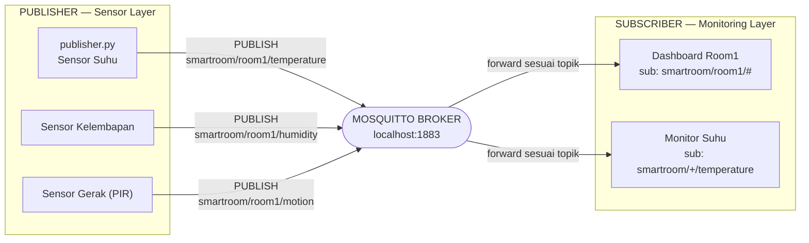

# Implementasi Komunikasi MQTT — Smart Room Monitoring

Tugas Praktikum *Cyber Physical System* — implementasi pola komunikasi
**publish–subscribe** berbasis **MQTT** menggunakan **Python (paho-mqtt)** dan
**Eclipse Mosquitto Broker**.

Studi kasus: **Smart Room Monitoring** — sensor suhu, kelembapan, dan gerak (PIR)
pada beberapa ruangan mengirim data ke broker, lalu diteruskan ke aplikasi
pemantauan sesuai topik yang di-subscribe.

---

## 👤 Identitas

| | |
|---|---|
| Nama | _(isi nama kamu)_ |
| NIM | _(isi NIM kamu)_ |
| Mata Kuliah | Cyber Physical System |
| Universitas | Universitas Brawijaya |

---

## 🧩 Struktur Topik

Hierarki topik yang digunakan:

```
smartroom/<ruangan>/<sensor>
```

Contoh:

```
smartroom/room1/temperature
smartroom/room1/humidity
smartroom/room1/motion
smartroom/room2/temperature
```

---

## 🔗 Model Komunikasi MQTT



Publisher (sensor) tidak berkomunikasi langsung dengan subscriber (aplikasi
monitoring). Semua pesan melewati **broker** yang meneruskannya berdasarkan
**topik** — inilah inti pola publish–subscribe pada MQTT.

---

## 📁 Struktur File

```
smart-room-mqtt/
├── mosquitto.conf                 # konfigurasi broker (listener + anonim)
├── model_komunikasi.mmd           # diagram model komunikasi (Mermaid)
├── publisher.py                   # Skenario 1 — publisher dasar
├── subscriber.py                  # Skenario 1 — subscriber dasar
├── publisher_qos.py               # Skenario 2 — kirim QoS 0, 1, 2
├── subscriber_qos.py              # Skenario 2 — subscriber QoS
├── publisher_multi.py             # Skenario 3/4/5 — publish ke banyak topik
├── subscriber_multi.py            # Skenario 3 — subscribe beberapa topik
├── subscriber_wildcard_plus.py    # Skenario 4 — wildcard "+"
├── subscriber_wildcard_hash.py    # Skenario 5 — wildcard "#"
└── README.md
```

---

## ⚙️ Prasyarat (Requirements)

- **Eclipse Mosquitto Broker** 2.x — https://mosquitto.org/download/
- **Python** 3.x — https://www.python.org/downloads/
- Library **paho-mqtt** 2.x

Instal library:

```bash
pip install paho-mqtt
```

> **Catatan:** kode ini ditulis untuk **paho-mqtt 2.x**, yang mewajibkan
> `mqtt.Client(mqtt.CallbackAPIVersion.VERSION2)` dan callback dengan parameter
> `reason_code` & `properties`. Sintaks ini berbeda dari paho-mqtt 1.x.

---

## ▶️ Cara Menjalankan

Semua perintah dijalankan dari folder proyek. Butuh beberapa terminal terpisah
(broker, subscriber, publisher) yang berjalan bersamaan.

### 1. Jalankan Broker

```bash
mosquitto -v -c mosquitto.conf
```

`-v` = mode verbose (menampilkan log koneksi, SUBSCRIBE, PUBLISH, dan handshake
QoS). Biarkan terminal ini tetap terbuka.

Isi `mosquitto.conf`:

```conf
listener 1883
allow_anonymous true
```

### 2. Jalankan Skenario

Buka terminal **subscriber** lebih dulu, baru terminal **publisher**.

| Skenario | Subscriber | Publisher |
|---|---|---|
| **1. Pub–Sub dasar** | `python subscriber.py` | `python publisher.py` |
| **2. QoS 0, 1, 2** | `python subscriber_qos.py` | `python publisher_qos.py` |
| **3. Beberapa topik** | `python subscriber_multi.py` | `python publisher_multi.py` |
| **4. Wildcard `+`** | `python subscriber_wildcard_plus.py` | `python publisher_multi.py` |
| **5. Wildcard `#`** | `python subscriber_wildcard_hash.py` | `python publisher_multi.py` |

Hentikan program apa pun dengan `Ctrl + C`.

---

## 📊 Ringkasan Hasil Pengujian

| Skenario | Topik Subscriber | Perilaku yang Diamati |
|---|---|---|
| 1 | `smartroom/room1/temperature` | Subscriber menerima setiap data yang dipublish |
| 2 | `smartroom/room1/temperature` (QoS 2) | QoS 0 tanpa balasan; QoS 1 → PUBACK; QoS 2 → PUBREC/PUBREL/PUBCOMP |
| 3 | 3 topik eksplisit room1 | `room2/temperature` dikirim tapi tidak diterima (penyaringan topik) |
| 4 | `smartroom/+/temperature` | Menerima temperature dari **semua** ruangan |
| 5 | `smartroom/room1/#` | Menerima **semua** sensor di room1 |

---

## 🧠 Konsep QoS

| QoS | Jaminan | Mekanisme |
|---|---|---|
| 0 | *at most once* | Kirim sekali, tanpa konfirmasi |
| 1 | *at least once* | PUBLISH → PUBACK |
| 2 | *exactly once* | PUBLISH → PUBREC → PUBREL → PUBCOMP |

---

## 🧠 Konsep Wildcard

| Simbol | Arti | Contoh | Cocok dengan |
|---|---|---|---|
| `+` | satu level bebas | `smartroom/+/temperature` | `smartroom/room1/temperature`, `smartroom/room2/temperature` |
| `#` | semua level setelahnya (harus di akhir) | `smartroom/room1/#` | semua sensor di bawah `room1` |
